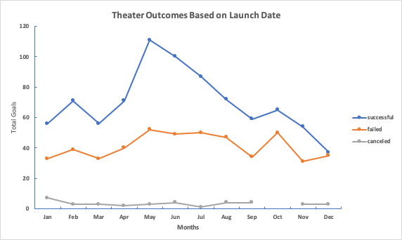
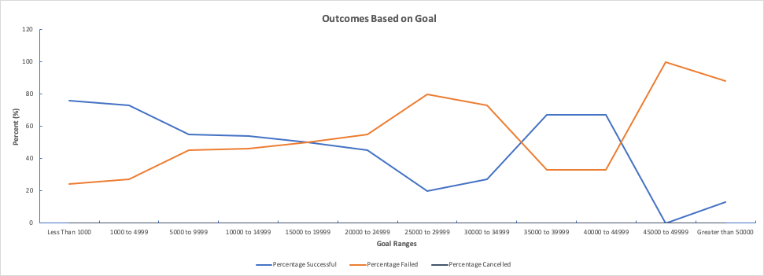

# Kickstarter Analysis Module-1 Challenge
Performing analysis to complete the module 1 challenge 

## *Overview of Project*

#### A data analysis was performed to assess how other campaigns' fund raising goals fared with the client's (Louise) play "Fever" in relation to their launch dates and their funding goals.

## *Analysis and Challenges*

### Analysis of Outcomes Based on Launch Date

- As shown on chart 1, May is a successful month to launch campaigns.

Chart 1:

### Analysis of Outcomes Based on Goals

- As shown on chart 2, a goal of less than or equal to one thousand is enough to fund a campaign. 

Chart 2:

### Challenges and Difficulties Encountered

- In terms of the exercise, I was not able to perform the grouping of data in the pivot table because the excel software automatically grouped the row labels for me.  

## *Results*

- What are two conclusions you can draw about the Outcomes based on Launch Date?

1. *Based on the results, it can be concluded that most of the campaigns launched around the last two months of Q2 particularly the month of May has a high probability of success.*

2. *Campaigns when launched around Q1 and Q4 of the year have more chances of failing probably because these are the busiest months of the year. Refer to chart 3 below.*

Chart 3:

- What can you conclude about the Outcomes based on Goals?

1. *The data shows that most successful campaigns that have funding goals that are less than five thousand are successful, even more so when it is less than equal to one thousand dollars. Chart 4 shows the outcomes based on goal with the number of total projects. It seems that more people tend to support campaigns that are not over budgetted.*  

Chart 4:

- What are some limitations of this dataset?

1. *It doesnt have the data that shows why low budgetted campaigns are mostly favored than high budgetted campaigns.*

- What are some other possible tables and/or graphs that we could create?

1. *Bar graphs, pie chart, etc...*
